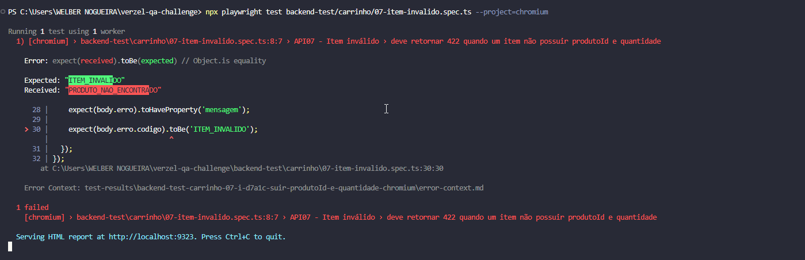

# BUG-API-002 — Item inválido retorna código incorreto

## Título

[API] Item sem produtoId e quantidade retorna PRODUTO_NAO_ENCONTRADO em vez de ITEM_INVALIDO

## Prioridade

MÉDIA

## Severidade

MÉDIA

## Status

ABERTO

## Endpoint

POST /api/carrinho/calcular




## Cenário

API07 — Item inválido

## Payload

```json
{
  "itens": [
    {}
  ]
}


Resultado esperado

Conforme documentação da API:
- HTTP 422
- código: ITEM_INVALIDO

Resultado atual
A API retorna:
- HTTP 422
- código: PRODUTO_NAO_ENCONTRADO
Evidência

Teste automatizado Playwright:
backend-test/carrinho/07-item-invalido.spec.ts