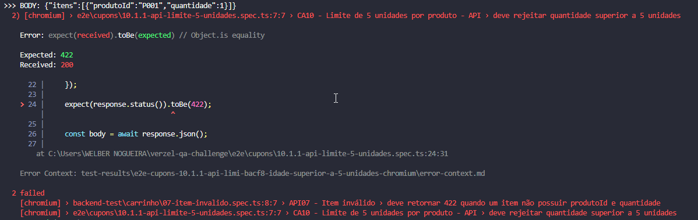

# BUG-CA10-API-001 — API aceita mais de 5 unidades por produto

## Identificação

| Campo | Informação |
|---|---|
| ID | BUG-CA10-API-001 |
| Cenário | CA10 — Limite máximo de 5 unidades por produto |
| Tipo | BUG 
| Prioridade | ALTA |
| Severidade | ALTA |
| Módulo | API / Carrinho |
| Endpoint | `POST /api/carrinho/calcular` |
| Ambiente | Verzel Store — Ambiente de Teste Técnico |
| Status | ABERTO |

---

## Descrição

A API permite o envio de quantidade superior ao limite máximo de
**5 unidades por produto**, contrariando a regra definida no desafio.

A interface impede corretamente a inclusão da 6ª unidade, porém a
API aceita diretamente uma quantidade igual a 6 e realiza o cálculo
do carrinho.

---

## Regra esperada

De acordo com a documentação da API:

> A quantidade de um produto não pode ser superior a 5 unidades.




Para quantidade superior a 5, a API deve retornar:

```text
HTTP 422
Código: QUANTIDADE_MAXIMA_EXCEDIDA
Campo: itens[0].quantidade
