# Execução dos Testes Manuais — Verzel Store

> Documento de execução dos cenários manuais definidos na matriz de testes.
>
> **Orientação:** executar os cenários na ordem apresentada, registrar o resultado obtido, definir o veredito e inserir as evidências diretamente em cada cenário.

## Identificação

- **Projeto:** Verzel Store
- **Card:** VZS-142
- **Versão:** 2.3.0
- **Ambiente:** QA
- **Status inicial:** PENDENTE

## Convenção de execução

- **PASSOU:** resultado obtido atende integralmente ao resultado esperado.
- **NÃO PASSOU:** resultado obtido diverge do resultado esperado ou apresenta comportamento incorreto.
- **BLOQUEADO:** cenário não pôde ser executado por indisponibilidade do ambiente, dependência ou impedimento externo.
- Registrar no campo **Resultado obtido** o comportamento real observado.
- Inserir abaixo de cada cenário todos os prints necessários para comprovar a execução.
- Caso seja identificado um defeito, registrar o cenário como **FALHOU** e detalhar o bug no documento de bugs.

---

## CT-01 — Aplicar cupom válido BEMVINDO10

**Pré-requisito:** Carrinho com produto(s) válido(s) e cupom BEMVINDO10 disponível.

**Prioridade:** CRÍTICA

**Tipo:** FUNCIONAL

**Passos:**

1. Adicionar produto(s). 2. Aplicar BEMVINDO10. 3. Confirmar o cálculo.

**Resultado esperado:**

Cupom aplicado com 10% de desconto sobre o subtotal.

**Resultado obtido:**

Cupom aplicado com 10% de desconto sobre o subtotal.

**Veredito:** APROVADO/PASSOU

**Descrição:**

Validar CA01.

**Evidências:**

> **Evidências:**
>
> _[

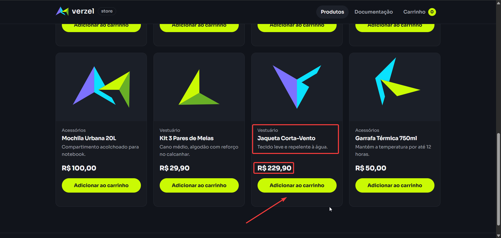

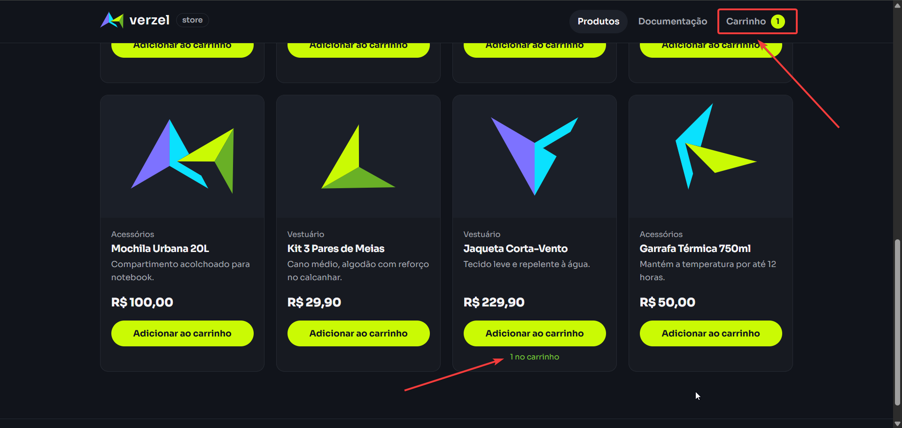

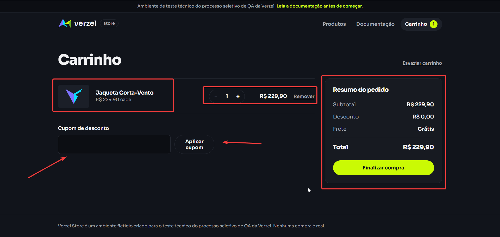

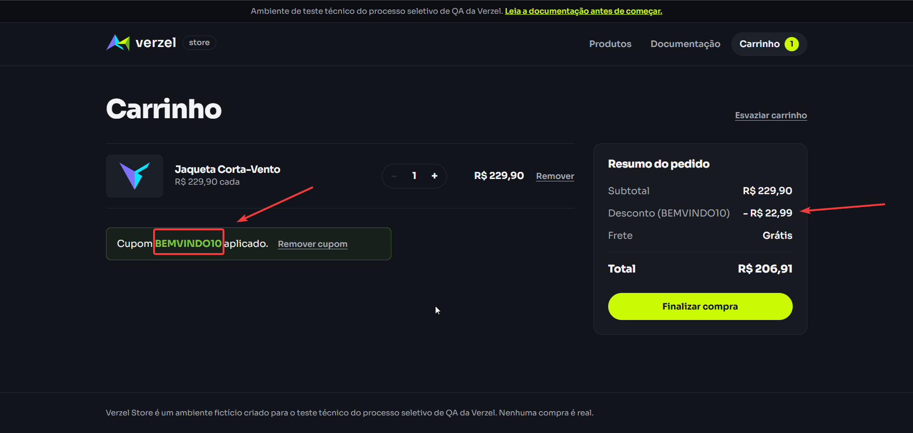

]_
---

## CT-02 — Aceitar cupom com maiúsculas/minúsculas e espaços nas extremidades

**Pré-requisito:** Carrinho válido e BEMVINDO10 disponível.

**Prioridade:** ALTA

**Tipo:** FUNCIONAL

**Passos:**

1. Aplicar variações de caixa e espaços, como ` bemvindo10 `. 2. Calcular.

**Resultado esperado:**

Código aceito independentemente de caixa; espaços no início/fim ignorados.

**Resultado obtido:**

Código aceito independentemente de caixa; espaços no início/fim ignorados.

**Veredito:** APROVADO/PASSOU

**Descrição:**

Validar CA02.

**Evidências:**

> **Evidências:**
>
> _[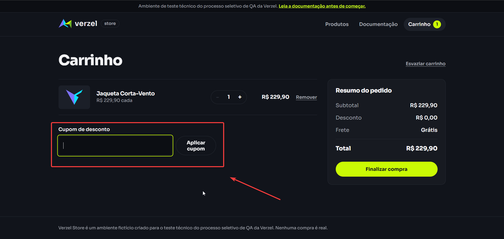

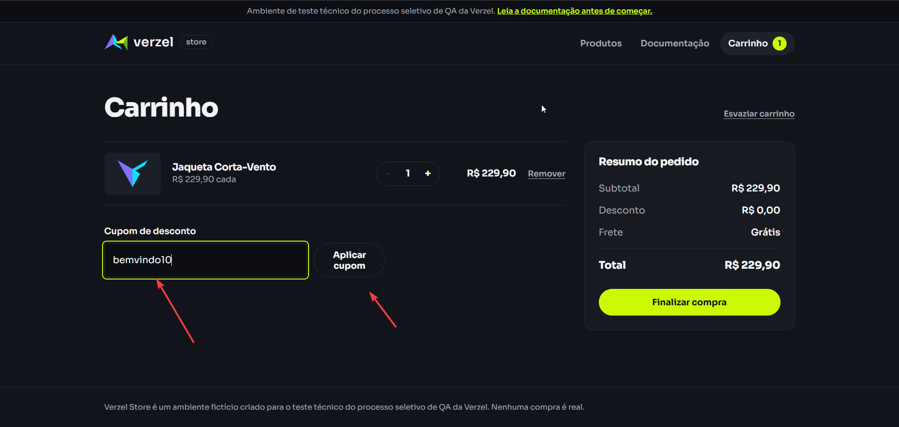

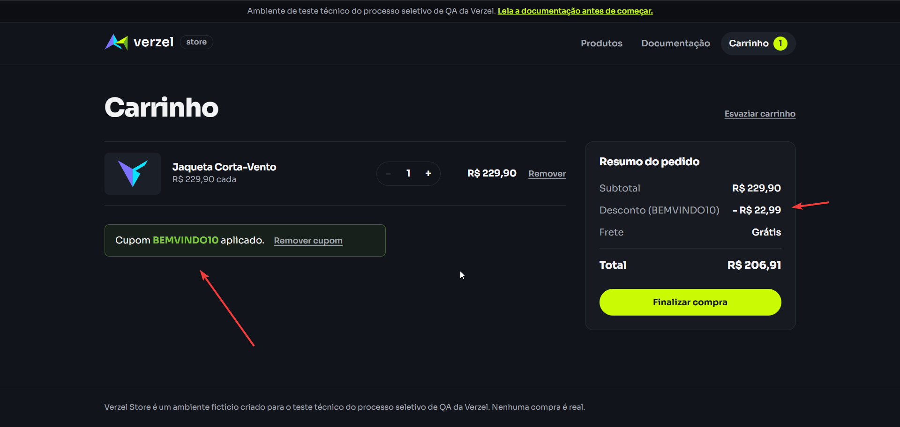

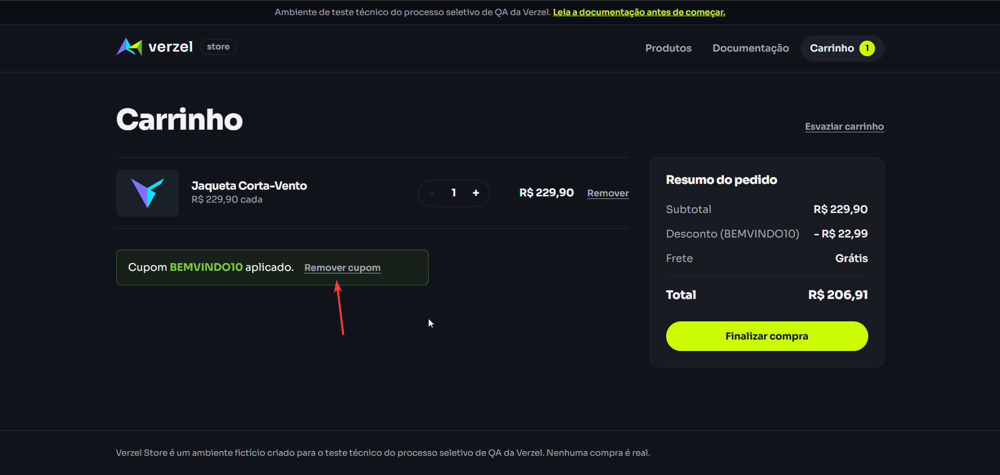

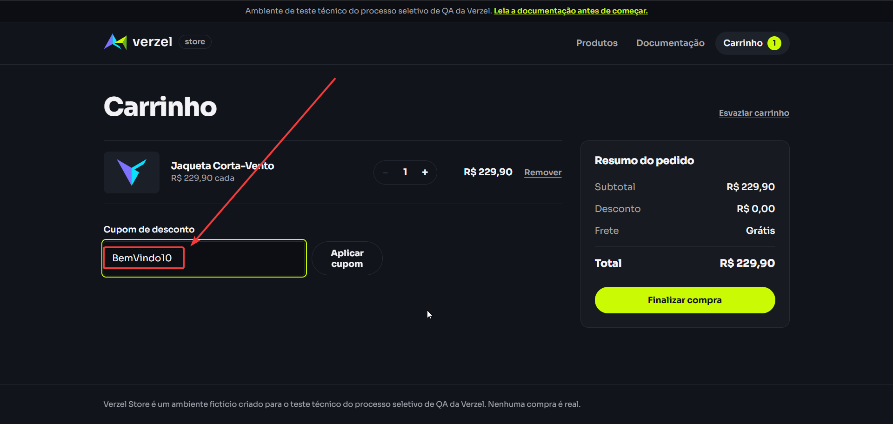

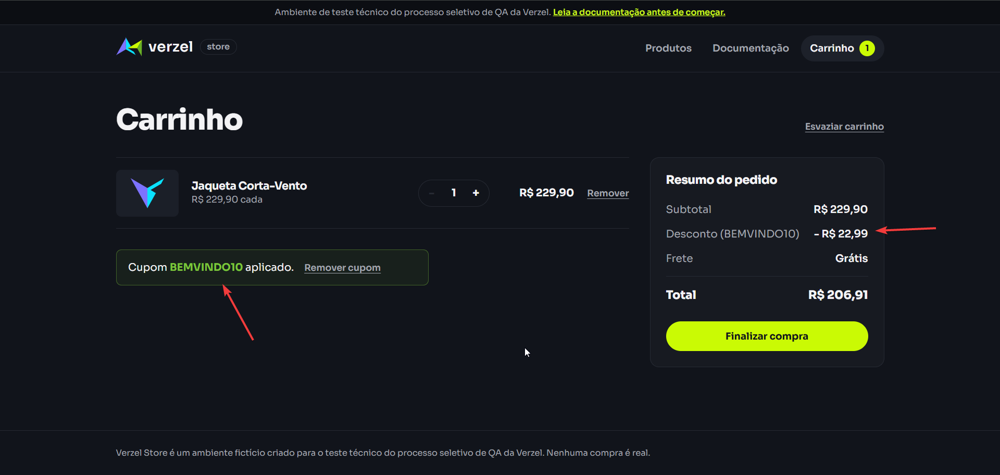

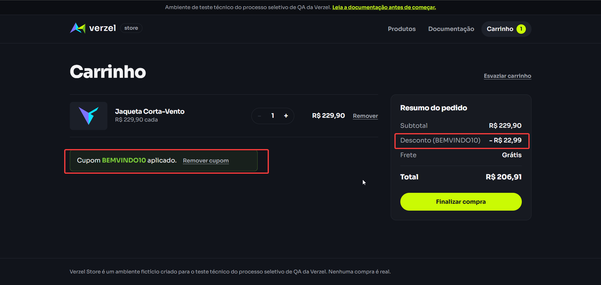

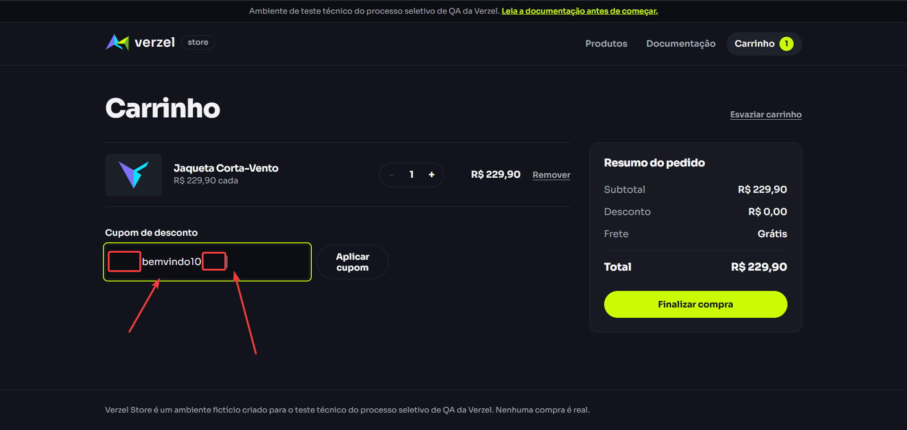

]_

---

## CT-03 — Rejeitar cupom inexistente

**Pré-requisito:** Carrinho com itens válidos.

**Prioridade:** ALTA

**Tipo:** FUNCIONAL

**Passos:**

1. Informar cupom inexistente. 2. Calcular carrinho.

**Resultado esperado:**

Resposta 200, sem desconto, com mensagem `Cupom inválido.`.

**Resultado obtido:**

Resposta 200, sem desconto, com mensagem `Cupom inválido.`.

**Veredito:** APROVADO/PASSOU

**Descrição:**

Validar CA03.

**Evidências:**

> _[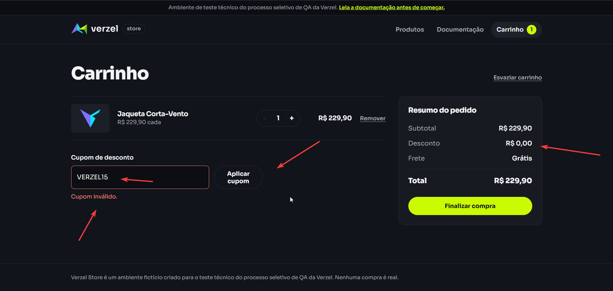]_

---

## CT-04 — Rejeitar cupom expirado

**Pré-requisito:** Carrinho válido e VERAO2026 disponível como expirado.

**Prioridade:** ALTA

**Tipo:** FUNCIONAL

**Passos:**

1. Informar VERAO2026. 2. Calcular carrinho.

**Resultado esperado:**

Resposta 200, sem desconto, com mensagem `Cupom expirado.`.

**Resultado obtido:**

Resposta 200, sem desconto, com mensagem `Cupom expirado.`.

**Veredito:** APROVADO/PASSOU

**Descrição:**

Validar CA04.

**Evidências:**

> _[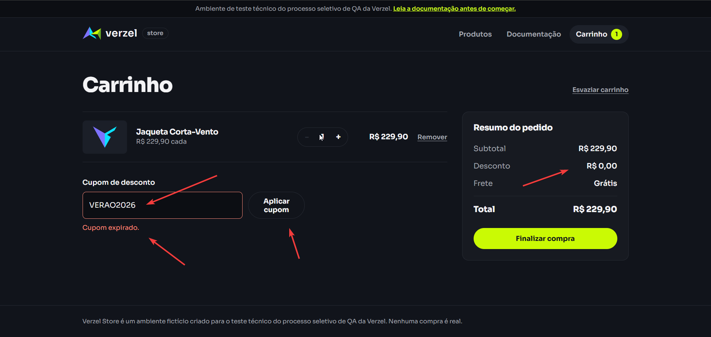]_

---

## CT-05 — Impedir aplicação simultânea de mais de um cupom

**Pré-requisito:** Carrinho válido e dois códigos disponíveis.

**Prioridade:** MÉDIA

**Tipo:** FUNCIONAL

**Passos:**

1. Aplicar um cupom. 2. Tentar aplicar outro sem remover o primeiro.

**Resultado esperado:**

Somente um cupom permanece aplicado; para trocar, remover o atual antes de aplicar outro.

**Resultado obtido:**

Somente um cupom permanece aplicado; para trocar, remover o atual antes de aplicar outro.

**Veredito:**  APROVADO/PASSOU

**Descrição:**

Validar CA05.

**Evidências:**

>
> _[
    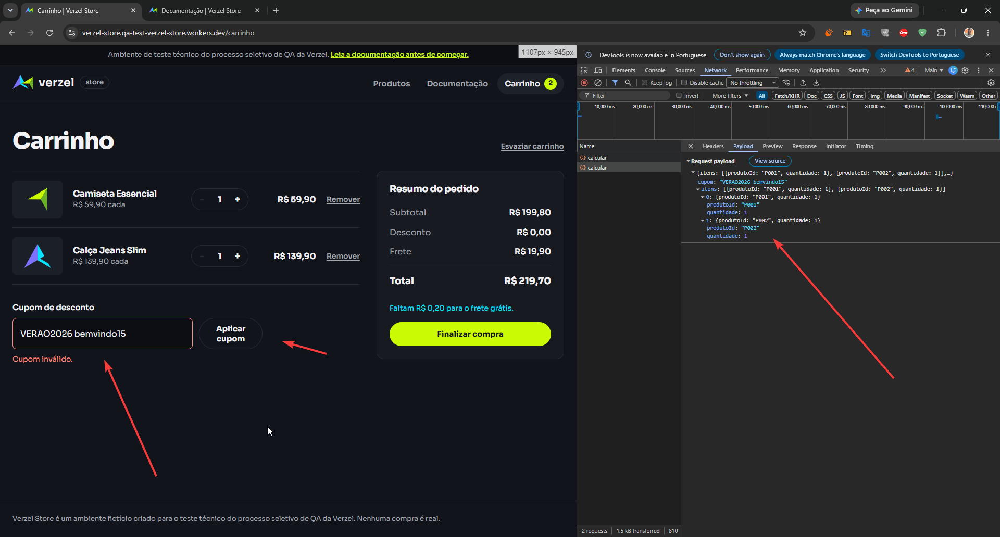
    
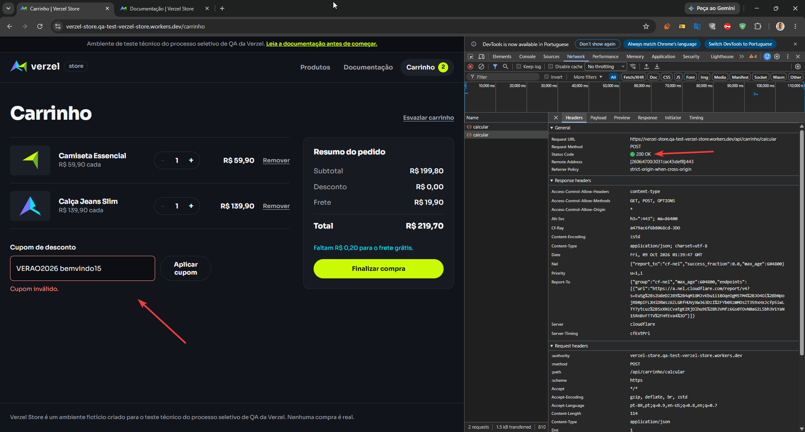

]_

---

## CT-06 — Frete grátis no limite de R$ 200,00

**Pré-requisito:** Carrinho com subtotal exatamente R$ 200,00.

**Prioridade:** CRÍTICA

**Tipo:** FUNCIONAL

**Passos:**

1. Montar subtotal de R$ 200,00. 2. Calcular.

**Resultado esperado:**

Frete R$ 0,00 e valor faltante R$ 0,00.

**Resultado obtido:**

Frete R$ 0,00 e valor faltante R$ 0,00.

**Veredito:** APROVADO/PASSOU

**Descrição:**

Validar CA06.

**Evidências:**

>
> _[
    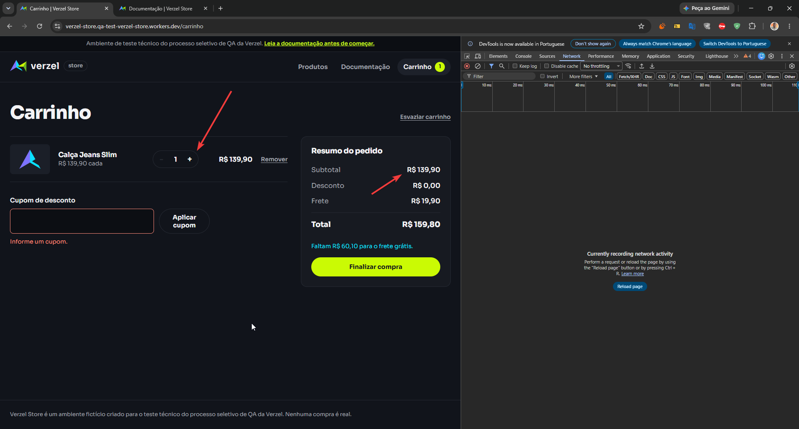

!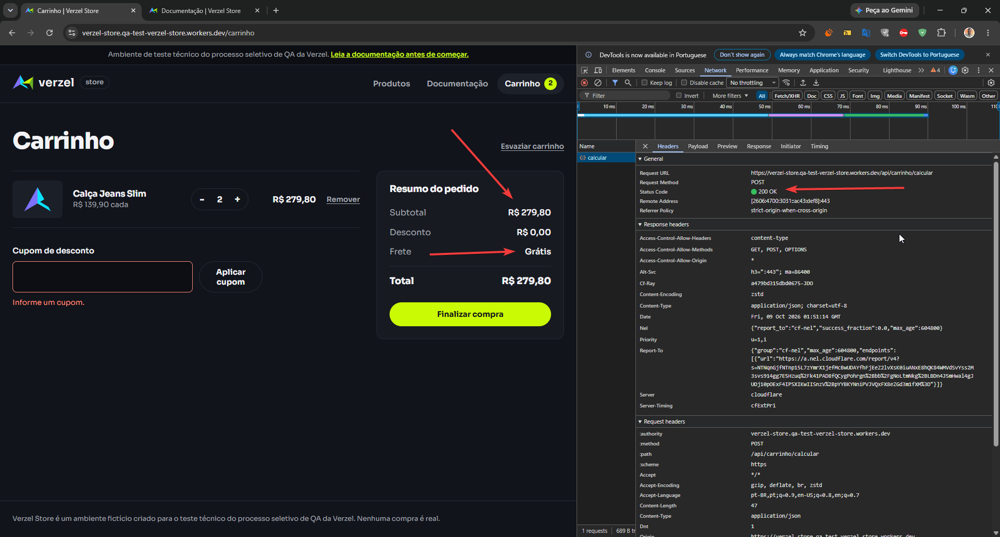

]_

---

## CT-07 — Frete de R$ 19,90 abaixo de R$ 200,00

**Pré-requisito:** Carrinho com subtotal inferior a R$ 200,00.

**Prioridade:** CRÍTICA

**Tipo:** FUNCIONAL

**Passos:**

1. Montar subtotal abaixo de R$ 200,00. 2. Calcular.

**Resultado esperado:**

Frete R$ 19,90 e valor faltante = R$ 200,00 - subtotal, nunca negativo.

**Resultado obtido:**

Frete R$ 19,90 e valor faltante = R$ 200,00 - subtotal, nunca negativo.

**Veredito:** APROVADO/PASSOU

**Descrição:**

Validar CA07.

**Evidências:**

>
> _[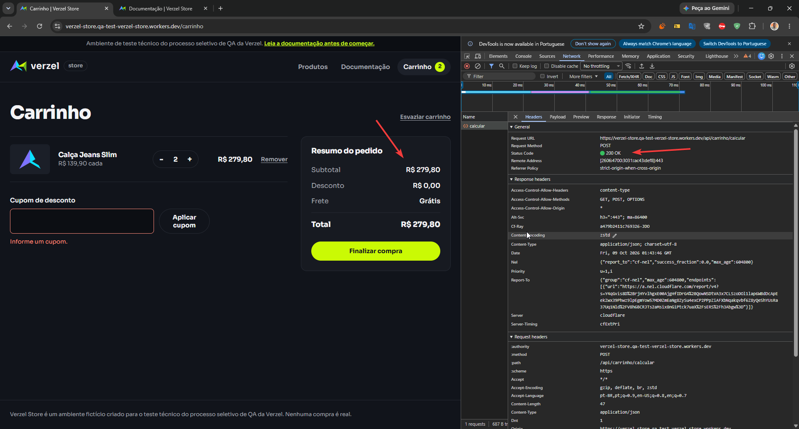i]_

---

## CT-08 — Frete considera subtotal antes do desconto

**Pré-requisito:** Subtotal superior ou igual a R$ 200,00 e cupom válido.

**Prioridade:** CRÍTICA

**Tipo:** FUNCIONAL

**Passos:**

1. Montar carrinho. 2. Aplicar BEMVINDO10. 3. Calcular.

**Resultado esperado:**

Elegibilidade do frete considera o subtotal antes do desconto; subtotal >= R$ 200,00 gera frete R$ 0,00.

**Resultado obtido:**

Elegibilidade do frete considera o subtotal antes do desconto; subtotal >= R$ 200,00 gera frete R$ 0,00.

**Veredito:** APROVADO/PASSOU

**Descrição:**

Validar CA08.

**Evidências:**

>
> _[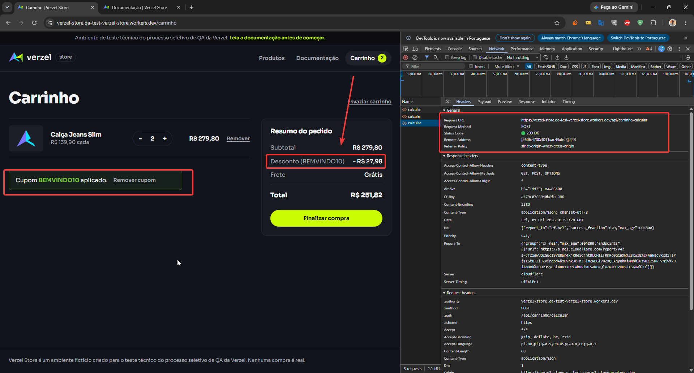

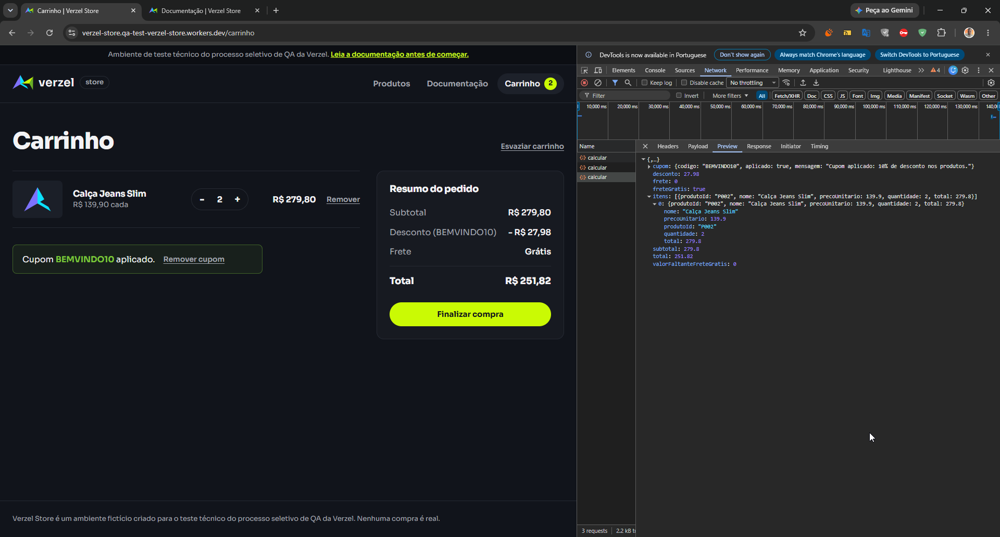]_

---

## CT-09 — Desconto não incide sobre o frete

**Pré-requisito:** Subtotal inferior a R$ 200,00 e cupom válido.

**Prioridade:** ALTA

**Tipo:** FUNCIONAL

**Passos:**

1. Montar carrinho. 2. Aplicar BEMVINDO10. 3. Calcular.

**Resultado esperado:**

Desconto de 10% somente sobre produtos; frete de R$ 19,90 não sofre desconto.

**Resultado obtido:**

Desconto de 10% somente sobre produtos; frete de R$ 19,90 não sofre desconto.

**Veredito:** APROVADO/PASSOU

**Descrição:**

Validar CA09.

**Evidências:**

>
> _[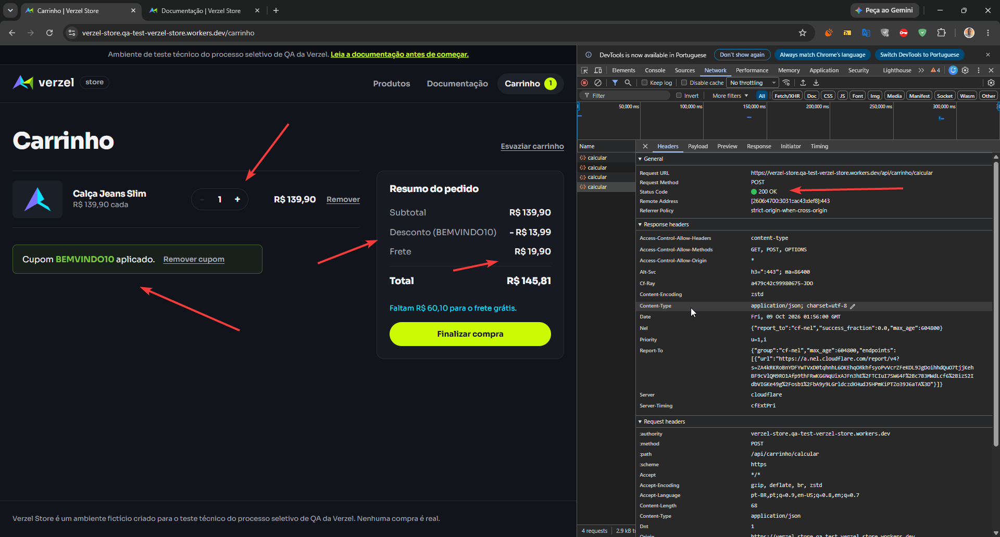]_

---

## CT-10 — Rejeitar quantidade inválida

**Pré-requisito:** API disponível.

**Prioridade:** ALTA

**Tipo:** FUNCIONAL

**Passos:**

1. Enviar quantidade 0. 2. Repetir negativa. 3. Repetir decimal.

**Resultado esperado:**

API rejeita valores que não sejam inteiros >= 1 com `QUANTIDADE_INVALIDA`.

**Resultado obtido:**

API rejeita valores que não sejam inteiros >= 1 com `QUANTIDADE_INVALIDA`.

**Veredito:** APROVADO/PASSOU

**Descrição:**

Validar regra de quantidade.

**Evidências:**

>
> _[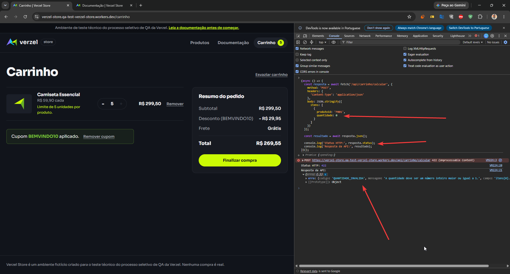]_

---

## CT-11 — Rejeitar quantidade superior a 5 - Bug na API - Validação Manual

**Pré-requisito:** API disponível.

**Prioridade:** ALTA

**Tipo:** FUNCIONAL

**Passos:**

1. Enviar quantidade 6 ou maior. 2. Analisar response.

**Resultado esperado:**

Status 422 com `QUANTIDADE_MAXIMA_EXCEDIDA`.

**Resultado obtido:**

Status 200.

**Veredito:** REPROVADO/NÃO PASSOU

**Descrição:**

Validar CA10.

**Evidências:**

>
> _[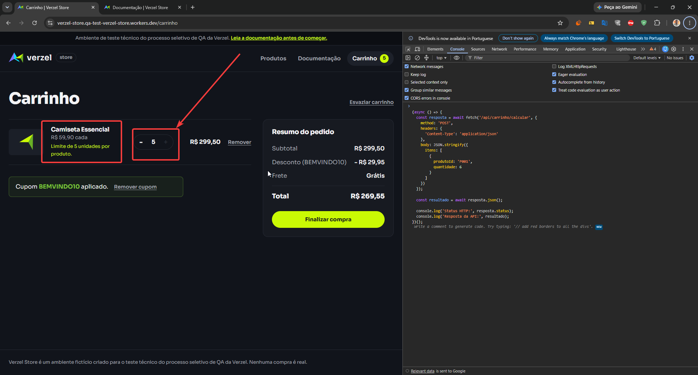

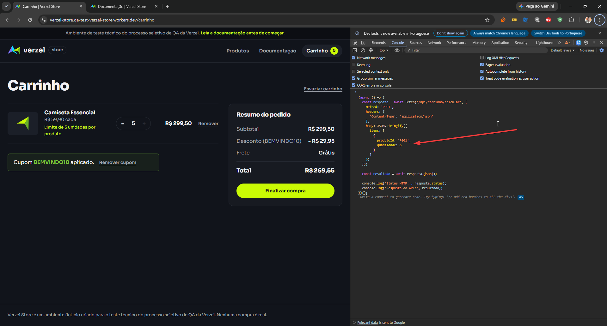

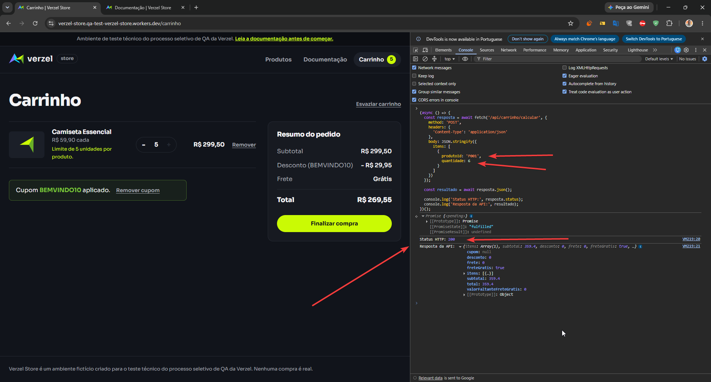]_

-> Encontramos um bug, deveria retornar outra exception, mas retornou 200 OK. Esse erro já foi reportado e será indicado com mais detalhes onde ser consultado no readme.

---

## CT-12 — Arredondar valores monetários para 2 casas

**Pré-requisito:** Carrinho que gere valores decimais.

**Prioridade:** MÉDIA

**Tipo:** FUNCIONAL

**Passos:**

1. Calcular carrinho. 2. Conferir valores retornados.

**Resultado esperado:**

Valores monetários arredondados para 2 casas.

**Resultado obtido:**

Valores monetários arredondados para 2 casas.

**Veredito:** APROVADO/PASSOU

**Descrição:**

Validar CA11.

**Evidências:**

>
> _[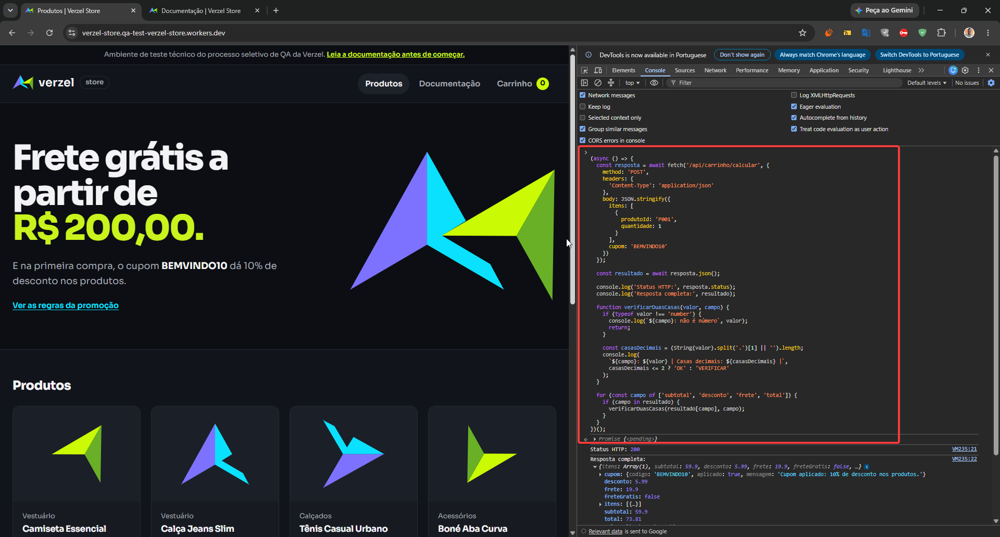

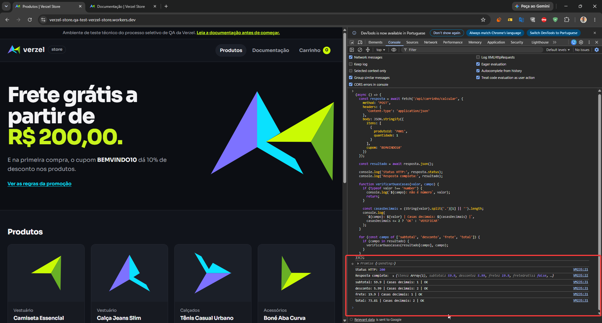

]_

---

## CT-13 — Validar fórmula do total

**Pré-requisito:** Carrinho válido com subtotal, desconto e frete conhecidos.

**Prioridade:** CRÍTICA

**Tipo:** FUNCIONAL

**Passos:**

1. Calcular. 2. Aplicar `total = subtotal - desconto + frete`. 3. Comparar.

**Resultado esperado:**

Total corresponde à fórmula documentada.

**Resultado obtido:**

Total corresponde à fórmula documentada.

**Veredito:** APROVADO/PASSOU

**Descrição:**

Validar consistência do cálculo.

**Evidências:**

>
> _[C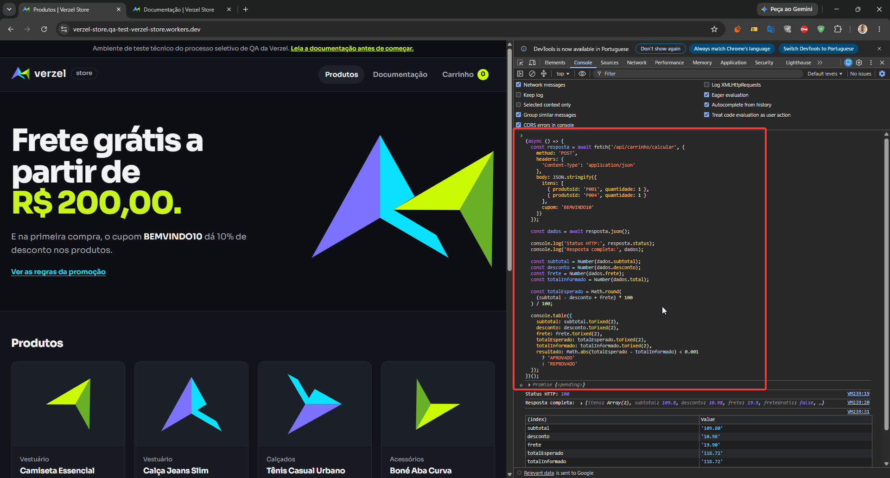

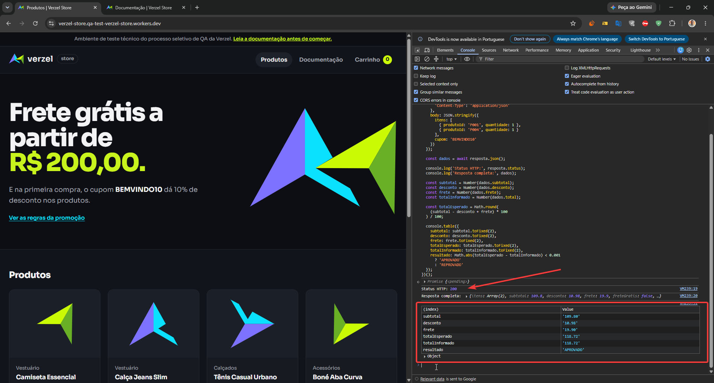

]_

---

## CT-14 — Rejeitar itens ausentes ou vazios

**Pré-requisito:** API disponível.

**Prioridade:** ALTA

**Tipo:** FUNCIONAL

**Passos:**

1. POST /api/carrinho/calcular sem `itens`. 2. Repetir com lista vazia.

**Resultado esperado:**

Status 422 com `ITENS_OBRIGATORIOS`.

**Resultado obtido:**

Status 422 com `ITENS_OBRIGATORIOS`.

**Veredito:** APROVADO/PASSOU

**Descrição:**

Validar contrato da API.

**Evidências:**

>
> _[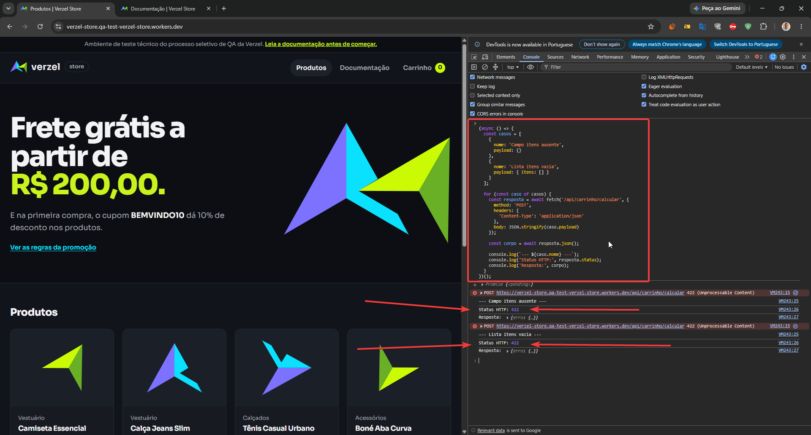

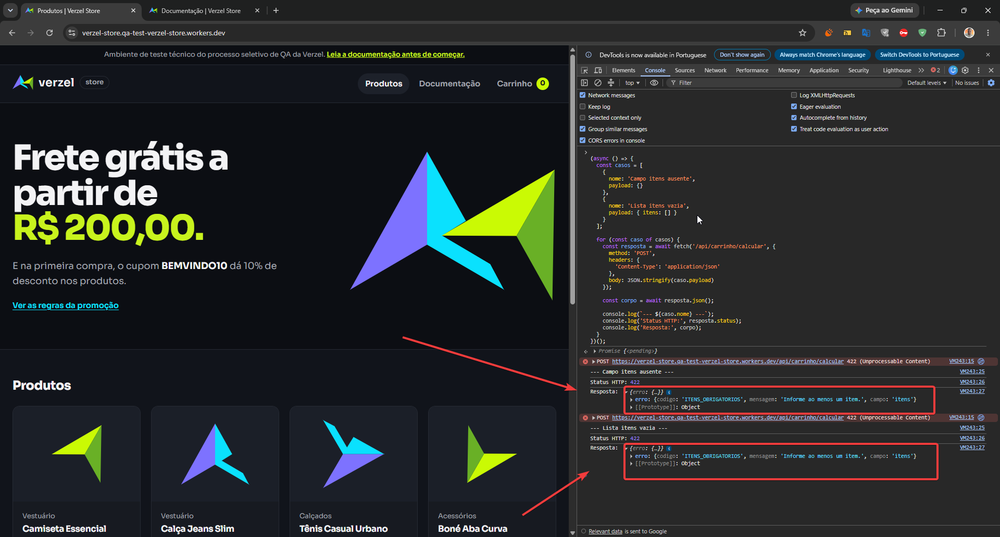]_

---

## CT-15 — Rejeitar item inválido - Cenário Feliz

**Pré-requisito:** API disponível.

**Prioridade:** ALTA

**Tipo:** FUNCIONAL

**Passos:**

1. Enviar item sem produtoId e/ou quantidade válida. 2. Analisar.

**Resultado esperado:**

Status 422 com `ITEM_INVALIDO`.

**Resultado obtido:**

Status 422 com `ITEM_INVALIDO`.

**Veredito:** APROVADO/PASSOU

**Descrição:**

Validar estrutura mínima do item.

**Evidências:**

>
> _[]_

---

## CT-15.1 — item inválido - Bug na API - Validação Manual

**Pré-requisito:** API disponível.

**Prioridade:** ALTA

**Tipo:** FUNCIONAL

**Passos:**

1. Enviar item sem produtoId e/ou quantidade válida. 2. Analisar.

**Resultado esperado:**

Esperado: HTTP 422, código ITEM_INVALIDO.

**Resultado obtido:**

Defeito identificado: HTTP 422, mas o código retornado é PRODUTO_NAO_ENCONTRADO.

**Veredito:** REPROVADO/NÃO PASSOU

**Descrição:**

Validar estrutura mínima do item.

**Evidências:**

>
> _[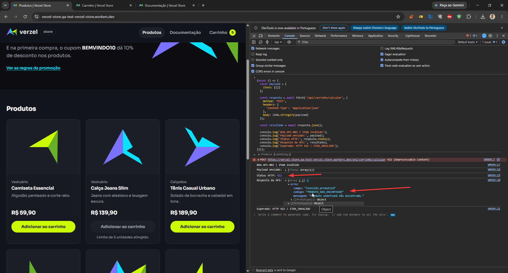]_

---

## CT-16 — Rejeitar produto inexistente

**Pré-requisito:** API disponível.

**Prioridade:** ALTA

**Tipo:** FUNCIONAL

**Passos:**

1. Enviar item com produtoId inexistente. 2. Analisar.

**Resultado esperado:**

Status 422 com `PRODUTO_NAO_ENCONTRADO`.

**Resultado obtido:**

Status 422 com `PRODUTO_NAO_ENCONTRADO`.

**Veredito:** APROVADO/PASSOU

**Descrição:**

Validar referência aos produtos.

**Evidências:**

>
> _[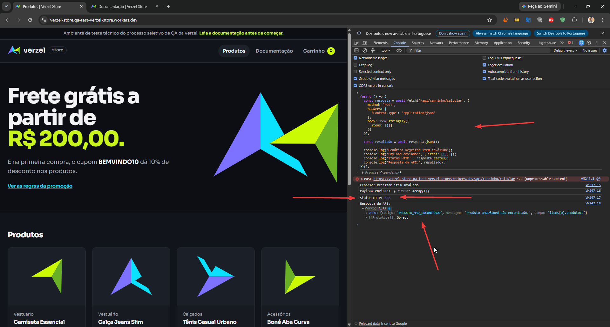]_

---

## CT-17 — Rejeitar produto duplicado

**Pré-requisito:** API disponível.

**Prioridade:** ALTA

**Tipo:** FUNCIONAL

**Passos:**

1. Enviar o mesmo produto mais de uma vez em `itens`. 2. Analisar.

**Resultado esperado:**

Status 422 com `ITEM_DUPLICADO`.

**Resultado obtido:**

Status 422 com `ITEM_DUPLICADO`.

**Veredito:** APROVADO/PASSOU

**Descrição:**

Validar regra de duplicidade.

**Evidências:**

>
> _[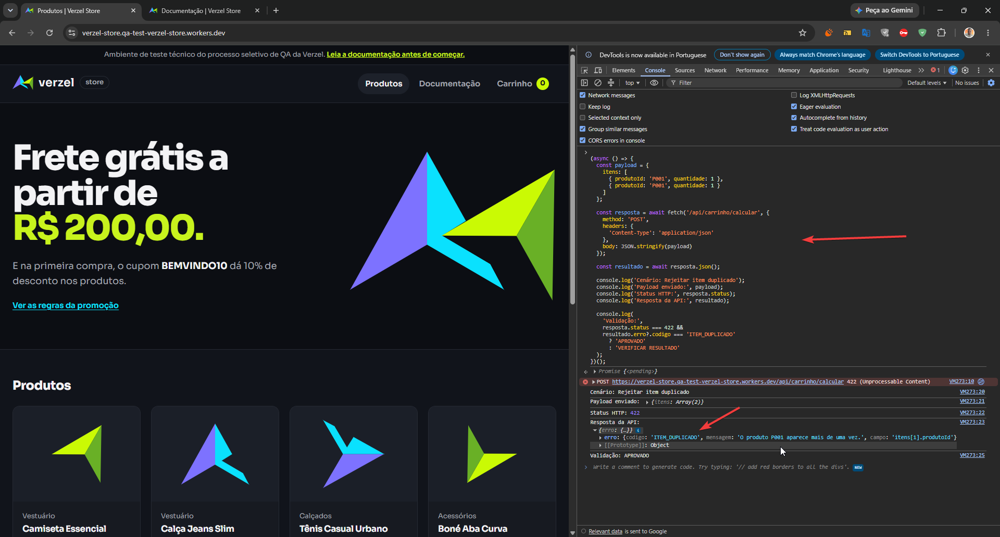]_

---

## CT-18 — Criar pedido com cupom válido

**Pré-requisito:** Carrinho válido e BEMVINDO10.

**Prioridade:** CRÍTICA

**Tipo:** FUNCIONAL

**Passos:**

1. POST /api/pedidos com cliente, itens e cupom. 2. Analisar.

**Resultado esperado:**

Status 201, número no formato VZ-000000 e resumo com valores do cálculo.

**Resultado obtido:**

Status 201, número no formato VZ-000000 e resumo com valores do cálculo.

**Veredito:** APROVADO/PASSOU

**Descrição:**

Validar fluxo de confirmação.

**Evidências:**

>
> _[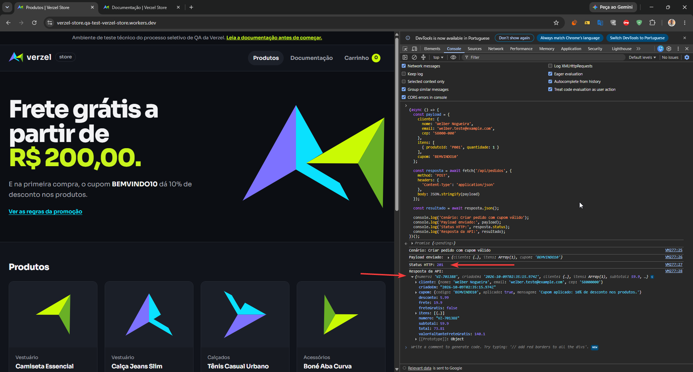]_

---

## CT-19 — Rejeitar pedido com cupom inválido ou expirado

**Pré-requisito:** Carrinho válido.

**Prioridade:** ALTA

**Tipo:** FUNCIONAL

**Passos:**

1. POST com cupom inexistente. 2. Repetir com expirado.

**Resultado esperado:**

Cupom inexistente: 422 `CUPOM_INVALIDO`; expirado: 422 `CUPOM_EXPIRADO`.

**Resultado obtido:**

Cupom inexistente: 422 `CUPOM_INVALIDO`; expirado: 422 `CUPOM_EXPIRADO`.

**Veredito:** APROVADO/PASSOU

**Descrição:**

Validar erros do endpoint de pedidos.

**Evidências:**

>
> _[

]_

---

## CT-20 — Validar dados do cliente

**Pré-requisito:** API disponível.

**Prioridade:** ALTA

**Tipo:** FUNCIONAL

**Passos:**

1. Enviar nome sem sobrenome. 2. E-mail inválido. 3. CEP inválido.

**Resultado esperado:**

Dados inválidos são rejeitados com 422 `DADOS_INVALIDOS` e detalhes em `campos`.

**Resultado obtido:**

Dados inválidos são rejeitados com 422 `DADOS_INVALIDOS` e detalhes em `campos`.

**Veredito:** APROVADO/PASSOU

**Descrição:**

Validar regras preexistentes.

**Evidências:**

>
> _[

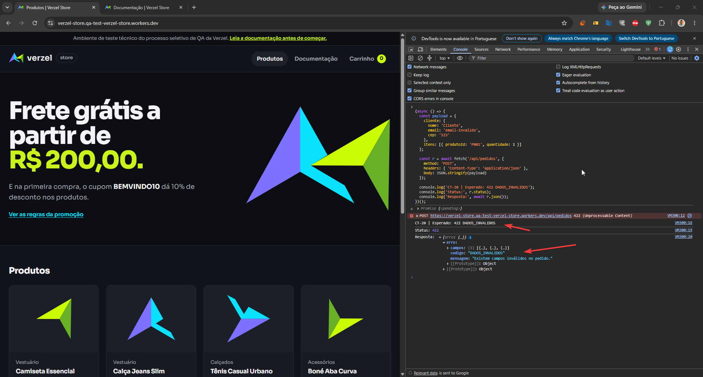

]_

---

## CT-21 — Validar JSON inválido, rota inexistente e método não permitido

**Pré-requisito:** API disponível.

**Prioridade:** MÉDIA

**Tipo:** FUNCIONAL

**Passos:**

1. Enviar JSON inválido. 2. Usar rota inexistente. 3. Usar método não permitido.

**Resultado esperado:**

400 `JSON_INVALIDO`; 404 `ROTA_NAO_ENCONTRADA`; 405 `METODO_NAO_PERMITIDO`.

**Resultado obtido:**

400 `JSON_INVALIDO`; 404 `ROTA_NAO_ENCONTRADA`; 405 `METODO_NAO_PERMITIDO`.

**Veredito:** APROVADO/PASSOU

**Descrição:**

Validar padrão de erros.

**Evidências:**

>
> _[

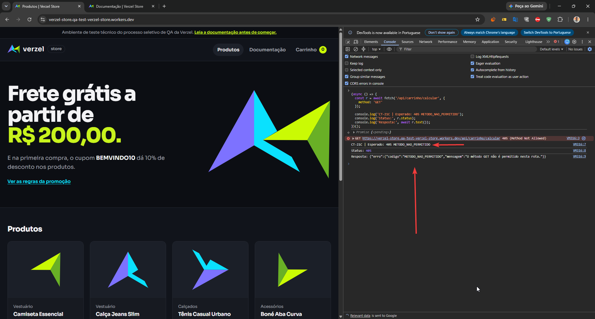

]_

---

## CT-22 — Consultar produto existente e inexistente

**Pré-requisito:** API disponível.

**Prioridade:** MÉDIA

**Tipo:** FUNCIONAL

**Passos:**

1. GET /api/produtos/P001. 2. GET produto inexistente.

**Resultado esperado:**

Produto existente retorna 200; inexistente retorna 404 `PRODUTO_NAO_ENCONTRADO`.

**Resultado obtido:**

Produto existente retorna 200; inexistente retorna 404 `PRODUTO_NAO_ENCONTRADO`.

**Veredito:** APROVADO/PASSOU

**Descrição:**

Validar endpoint de produto.

**Evidências:**

>
> _[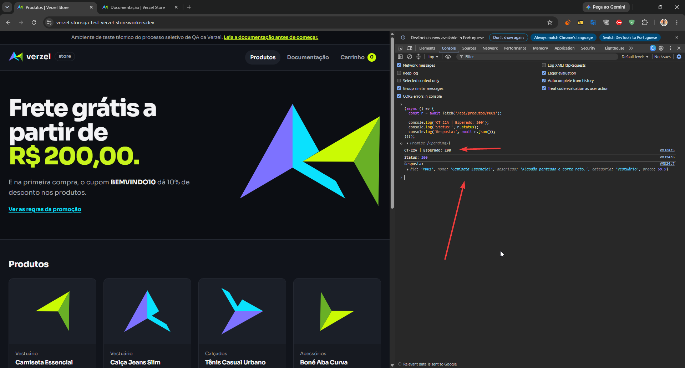

]_

---

## CT-23 — Validar isolamento do carrinho por aba/janela

**Pré-requisito:** Acesso à loja em navegador.

**Prioridade:** BAIXA

**Tipo:** FUNCIONAL

**Passos:**

1. Adicionar itens. 2. Abrir outra aba, outro navegador ou janela anônima. 3. Conferir carrinho.

**Resultado esperado:**

Carrinho é compartilhado somente na aba do navegador; os demais contextos iniciam vazios. Ou seja, os itens adicionados em uma aba não se reprlicam em outra. 

**Resultado obtido:**

Carrinho é compartilhado somente na aba do navegador; os demais contextos iniciam vazios. Ou seja, os itens adicionados em uma aba não se reprlicam em outra. 

**Veredito:** APROVADO/PASSOU

**Descrição:**

Validar comportamento explicitamente documentado.

**Evidências:**

>
> _[ 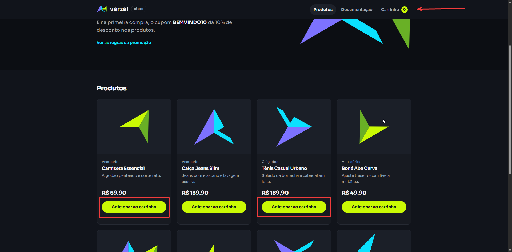

   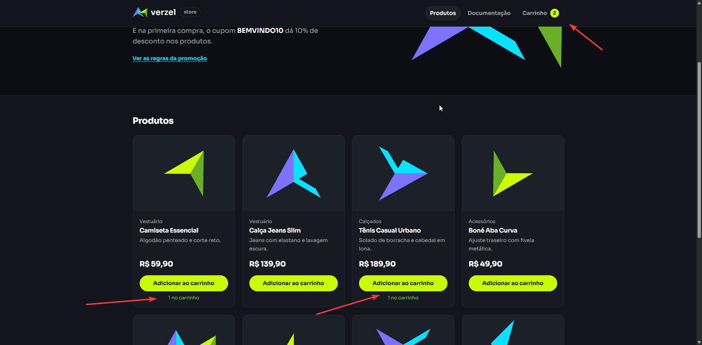 

    
]_

---

## CT-24 — Validar frete imediatamente abaixo do limite de R$200,00

**Pré-requisito:** Carrinho com subtotal de R$199,99.

**Prioridade:** MÉDIA

**Tipo:** FUNCIONAL

**Passos:**

1. Adicionar produtos até atingir subtotal de R$199,99.
2. Acessar o cálculo do carrinho.
3. Verificar frete e valor faltante para frete grátis.

**Resultado esperado:**

Frete de R$19,90; freteGratis=false; valorFaltanteFreteGratis=R$0,01.

**Resultado obtido:**

Frete de R$19,90; freteGratis=false; valorFaltanteFreteGratis=R$0,01.

**Veredito:** APROVADO/PASSOU

**Descrição:**

Validar limite inferior da regra CA06/CA07.

**Evidências:**

>
> _[

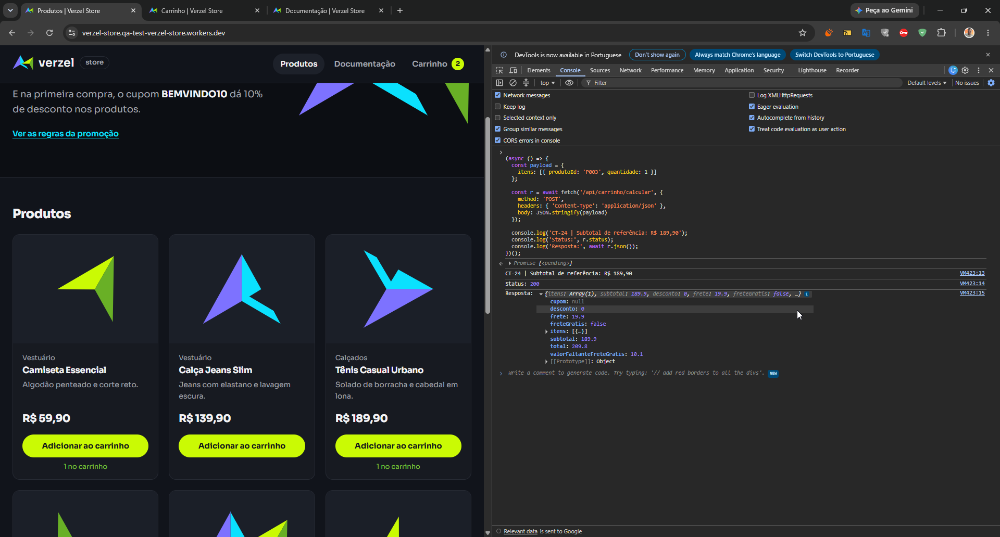

]_

---

## CT-25 — Validar frete imediatamente acima do limite de R$200,00

**Pré-requisito:** Carrinho com subtotal de R$200,01.

**Prioridade:** MÉDIA

**Tipo:** FUNCIONAL

**Passos:**

1. Adicionar produtos até atingir subtotal de R$200,01.
2. Acessar o cálculo do carrinho.
3. Verificar frete e valor faltante para frete grátis.

**Resultado esperado:**

Frete R$0,00; freteGratis=true; valorFaltanteFreteGratis=R$0,00.

**Resultado obtido:**

Frete R$0,00; freteGratis=true; valorFaltanteFreteGratis=R$0,00.

**Veredito:** APROVADO/PASSOU

**Descrição:**

Validar limite superior da regra CA06.

**Evidências:**

> _[
    
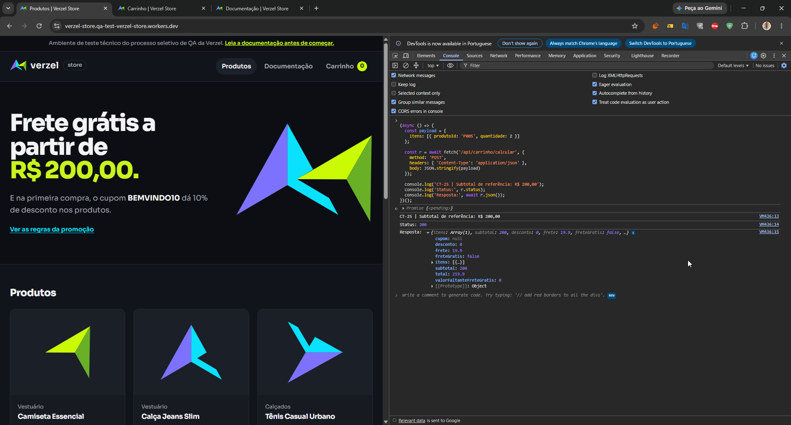

]_

---

## CT-26 — Validar frete grátis após aplicação de desconto quando subtotal original é elegível

**Pré-requisito:** Carrinho com subtotal de R$210,00 e cupom BEMVINDO10 válido.

**Prioridade:** ALTA

**Tipo:** FUNCIONAL

**Passos:**

1. Adicionar produtos totalizando R$210,00.
2. Aplicar o cupom BEMVINDO10.
3. Calcular o carrinho.
4. Conferir subtotal, desconto, frete e total.

**Resultado esperado:**

Subtotal R$210,00; desconto R$21,00; frete R$0,00; freteGratis=true; total R$189,00. A elegibilidade do frete considera o subtotal antes do desconto.

**Resultado obtido:**

200 OK. Subtotal R$210,00; desconto R$21,00; frete R$0,00; freteGratis=true; total R$189,00. A elegibilidade do frete considera o subtotal antes do desconto.

**Veredito:** APROVADO/PASSOU

**Descrição:**

Cenário crítico para CA08.

**Evidências:**

>
> _[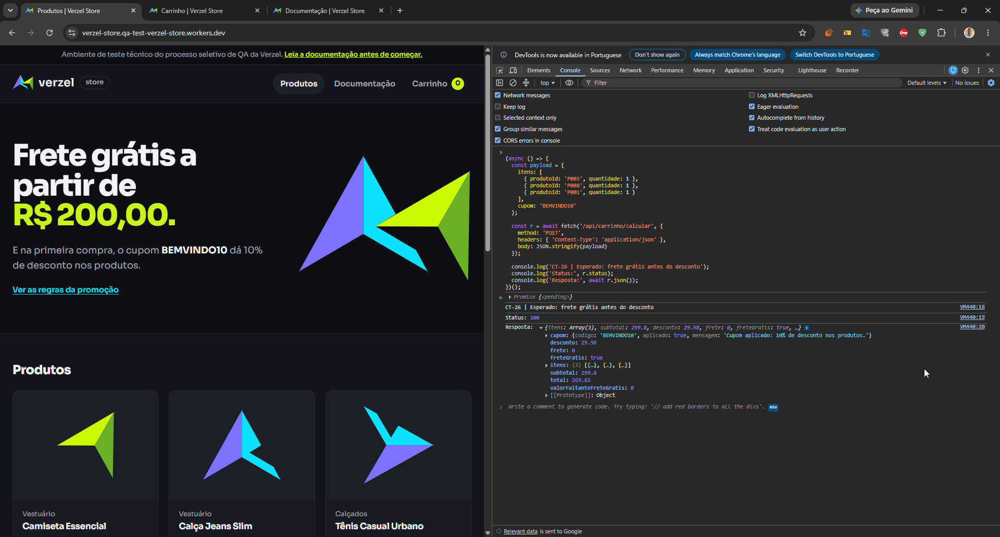]_

---

## CT-27 — Validar limite máximo de 5 unidades por produto na interface

**Pré-requisito:** Produto disponível no catálogo e carrinho vazio.

**Prioridade:** ALTA

**Tipo:** FUNCIONAL

**Passos:**

1. Adicionar 5 unidades do mesmo produto.
2. Tentar adicionar uma 6ª unidade pela interface.
3. Verificar o comportamento do carrinho.

**Resultado esperado:**

A interface não deve permitir que o pedido/carrinho contenha mais de 5 unidades do mesmo produto; registrar eventual mensagem de validação exibida.

**Resultado obtido:**

A interface não deve permitir que o pedido/carrinho contenha mais de 5 unidades do mesmo produto; registrar eventual mensagem de validação exibida.

**Veredito:** APROVADO/PASSOU

**Descrição:**

Complementa a validação da CA10 no nível da interface.

**Evidências:**

>
> _[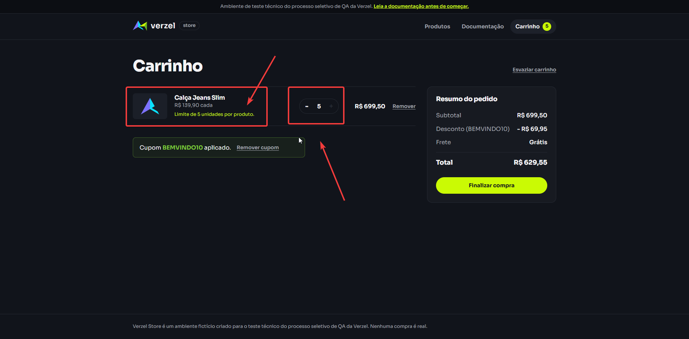

    ]_

---

## CT-28 — Consultar lista de produtos pela API

**Pré-requisito:** API disponível.

**Prioridade:** MÉDIA

**Tipo:** FUNCIONAL

**Passos:**

1. Executar GET /api/produtos.
2. Verificar status HTTP.
3. Validar estrutura da resposta e produtos retornados.

**Resultado esperado:**

HTTP 200; resposta em JSON contendo os produtos P001 a P008 conforme documentação.

**Resultado obtido:**

HTTP 200; resposta em JSON contendo os produtos P001 a P008 conforme documentação.

**Veredito:** APROVADO/PASSOU

**Descrição:**

Complementa o cenário de consulta de produto individual.

**Evidências:**

>
> _[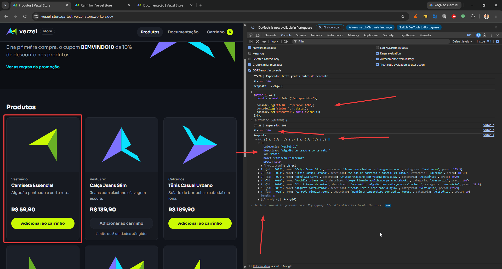]_

---

## CT-29 — Validar cálculo oficial de cupom pela API

**Pré-requisito:** API disponível.

**Prioridade:** ALTA

**Tipo:** FUNCIONAL

**Passos:**

1. Executar POST /api/carrinho/calcular com P002 quantidade 1, P004 quantidade 2 e cupom BEMVINDO10.
2. Validar a resposta.

**Resultado esperado:**

HTTP 200; subtotal R$239,70; desconto R$23,97; frete R$0,00; freteGratis=true; valorFaltanteFreteGratis=R$0,00; total R$215,73; cupom.aplicado=true; mensagem de cupom aplicado com 10% de desconto.

**Resultado obtido:**

HTTP 200; subtotal R$239,70; desconto R$23,97; frete R$0,00; freteGratis=true; valorFaltanteFreteGratis=R$0,00; total R$215,73; cupom.aplicado=true; mensagem de cupom aplicado com 10% de desconto.

**Veredito:** APROVADO/PASSOU

**Descrição:**

Reproduzir o exemplo oficial da documentação.

**Evidências:**

>
> _[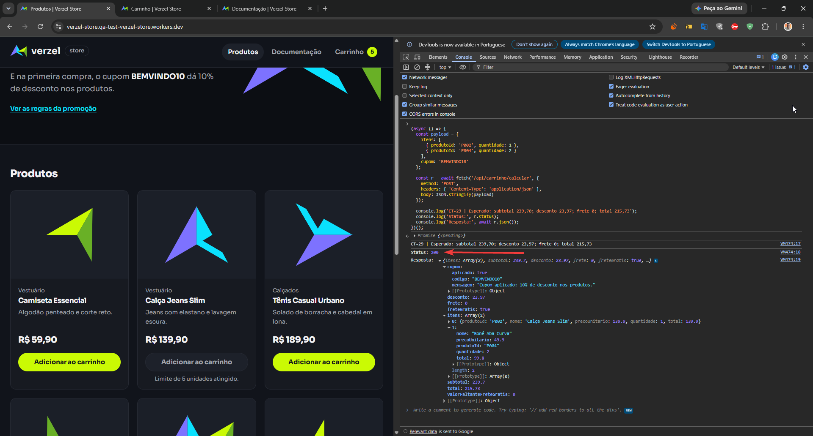]_

---

## CT-30 — Comparar resultado apresentado na interface com o cálculo da API

**Pré-requisito:** API e interface disponíveis; mesmo carrinho utilizado nos dois contextos.

**Prioridade:** ALTA

**Tipo:** INTEGRAÇÃO

**Passos:**

1. Montar um carrinho na interface.
2. Registrar subtotal, desconto, frete, frete grátis, valor faltante e total.
3. Reproduzir os mesmos itens e cupom na API.
4. Comparar os resultados.

**Resultado esperado:**

Os valores apresentados na interface devem ser iguais aos valores retornados pela API para o mesmo conjunto de itens e cupom.

**Resultado obtido:**

Os valores apresentados na interface foram ser iguais aos valores retornados pela API para o mesmo conjunto de itens e cupom.

**Veredito:** APROVADO/PASSOU

**Descrição:**

Valida a integração entre interface e API, considerando que os cálculos são realizados pela API.

**Evidências:**

>
> _[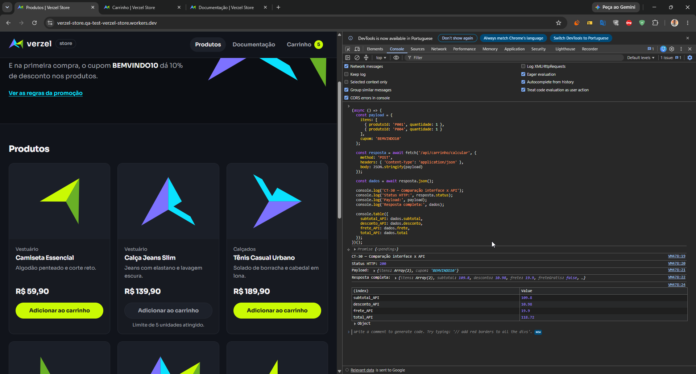]_

---

## CT-31 — Validar CEP com e sem hífen na criação do pedido

**Pré-requisito:** Dados do cliente válidos e carrinho com item válido.

**Prioridade:** MÉDIA

**Tipo:** FUNCIONAL

**Passos:**

1. Criar pedido informando CEP com hífen, no formato 01310-100.
2. Repetir a criação informando CEP sem hífen, no formato 01310100.
3. Comparar os resultados.

**Resultado esperado:**

As duas formas de CEP, com e sem hífen, devem ser aceitas conforme regra documentada de CEP com 8 dígitos.

**Resultado obtido:**

As duas formas de CEP, com e sem hífen, devem ser aceitas conforme regra documentada de CEP com 8 dígitos.

**Veredito:** APROVADO/PASSOU

**Descrição:**

Validar CA referente ao formato do CEP.

**Evidências:**

>
> _[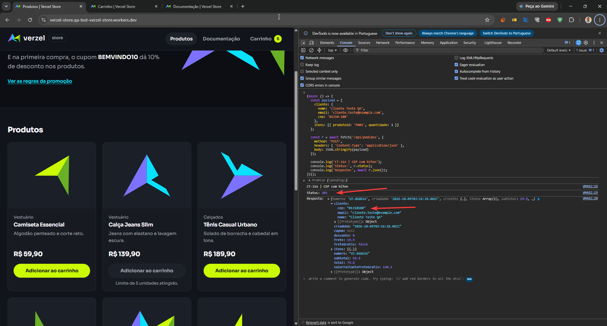i

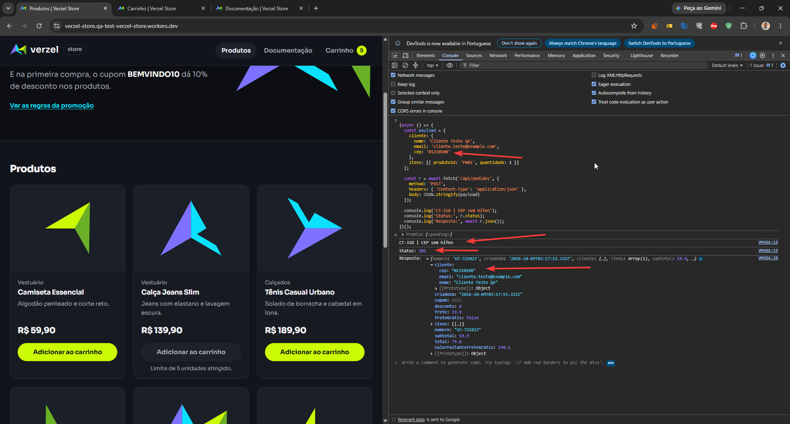

]_

